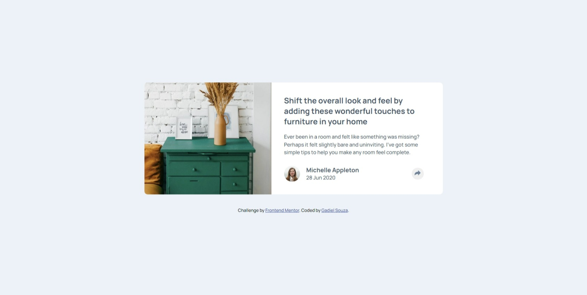

# Frontend Mentor - Article preview component solution

Essa é uma solução para o [Article preview component challenge on Frontend Mentor](https://www.frontendmentor.io/challenges/article-preview-component-dYBN_pYFT). Os desafios do Front End Mentor te ajudam a melhorar seu código criando projetos realistas.

## Screenshot

## Objetivos

Usuários devem ser capazes de:

- Ver o Layout ideal do componente dependendo do tamanho de tela do aparelho
- Ver os links para compartilhar as redes sociais quando eles clicam no ícone de compartilhar

## Construído com

- HTML Semântico
- CSS
- Javascript
- Flexbox
- Grid
- Desktop-first workflow

## Links

- URL do projeto: (https://gadiel-s.github.io/article-preview-component/)
- LinkedIn: (https://www.linkedin.com/in/gadielsouzafrontend/)
- Github: (https://github.com/Gadiel-S)
- Frontend Mentor - [@Gadiel-S](https://www.frontendmentor.io/profile/Gadiel-S)
- Portfolio - [Gadiel Souza de Barros](https://gadiel-s.github.io/meu-portfolio/)
