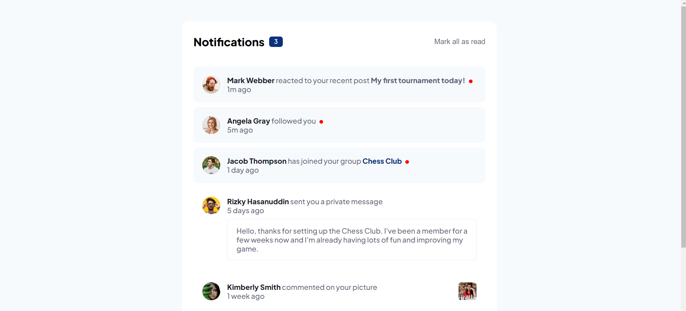

# Frontend Mentor - Notifications page solution

Essa é uma solução para o [Notifications page challenge on Frontend Mentor](https://www.frontendmentor.io/challenges/notifications-page-DqK5QAmKbC). Os desafios do Front End Mentor te ajudam a melhorar seu código criando projetos realistas. 

## Screenshot

## Objetivos

Usuários devem ser capazes de:

- Ver o Layout ideal do componente dependendo do tamanho de tela do aparelho
- Clicar nas notificações novas e mudá-las para "lidas"
- Clicar no botão "Mark all as read" e marcar todas as notificações como lidas
- Ver o número de notificações novas exibidas no painel "Notificações"

## Construído com

- HTML
- CSS
- Javascript
- Flexbox

## Links

- URL do projeto: (https://gadiel-s.github.io/notifications-page/)
- LinkedIn: (https://www.linkedin.com/in/gadielsouzafrontend/)
- Github: (https://github.com/Gadiel-S)
- Portfolio - [Gadiel Souza de Barros](https://gadiel-s.github.io/portfolio/)
- Frontend Mentor - [@Gadiel-S](https://www.frontendmentor.io/profile/Gadiel-S)
